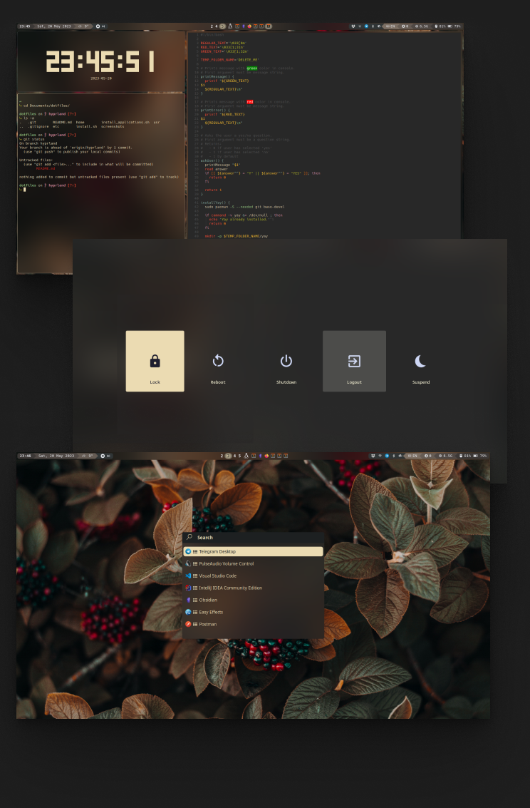

# 🐧 Hyprland .dotfiles

## Screenshots

## Installing
To automatically install the configuration files, run the following commands in the cloned directory.  
**DO NOT** do this as superuser!
```bash
chmod +x install.sh install_applications.sh && ./install.sh
```
## Firefox theme
[Waterfall](https://github.com/crambaud/waterfall)
## Software
### Display
- [**Wayland**](https://wayland.freedesktop.org/)
- [**Greetd**](https://sr.ht/~kennylevinsen/greetd/)
- [**Hyprland**](https://hyprland.org/)
- [**Waybar**](https://github.com/Alexays/Waybar)
- [**Swaybg**](https://github.com/swaywm/swaybg)
### Sound
- [**pipewire**](https://pipewire.org/)
- [**alsa**](https://www.alsa-project.org/wiki/Main_Page)
- [**Easy Effects**](https://github.com/wwmm/easyeffects)
### Appearance
- [**SDDM Sugar Candy theme**](https://github.com/Kangie/sddm-sugar-candy)
- [**Gruvbox GTK theme**](https://github.com/Fausto-Korpsvart/Gruvbox-GTK-Theme)
- [**Kora yellow icons**](https://www.gnome-look.org/p/1256209)
- [**Mocu Black mouse cursor**](https://github.com/sevmeyer/mocu-xcursor)
- [**Hack Nerd fonts**](https://github.com/ryanoasis/nerd-fonts/tree/master/patched-fonts/Hack)
### Utilities
- [**Yay**](https://github.com/Jguer/yay)
- [**Networkmanager**](https://wiki.archlinux.org/title/NetworkManager)
- [**Rofi**](https://github.com/davatorium/rofi)
- [**Playerctl**](https://github.com/altdesktop/playerctl)
- [**Blueman**](https://github.com/blueman-project/blueman)
- [**Dunst**](https://github.com/dunst-project/dunst)
- [**Brightnessctl**](https://github.com/Hummer12007/brightnessctl)
- [**Grimblast**](https://github.com/hyprwm/contrib)
- [**Hyprpicker**](https://github.com/hyprwm/hyprpicker)
- [**XFCE Polkit**](https://github.com/ncopa/xfce-polkit)
- [**Checkupdates**](https://man.archlinux.org/man/community/pacman-contrib/checkupdates.8.en)
- [**tlpui**](https://github.com/d4nj1/TLPUI)
- [**tty-clock**](https://github.com/xorg62/tty-clock)


